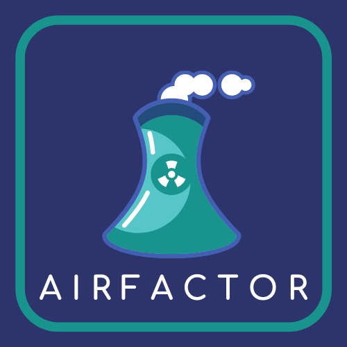
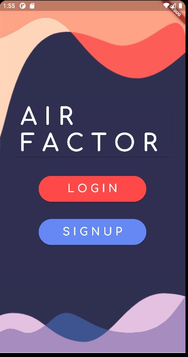
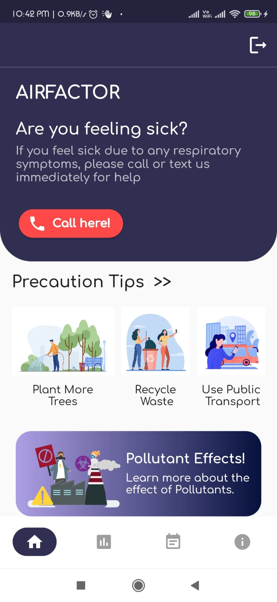
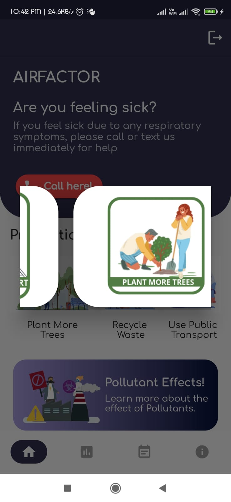
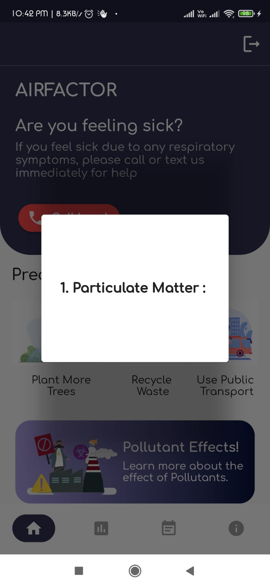
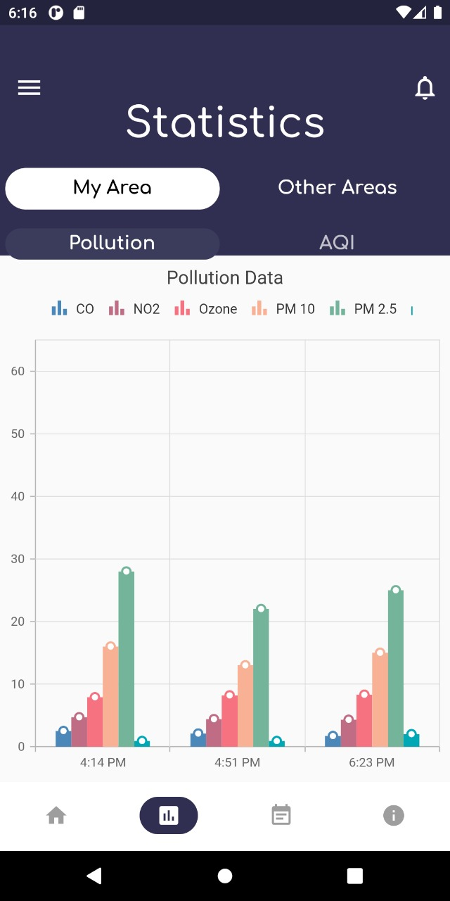
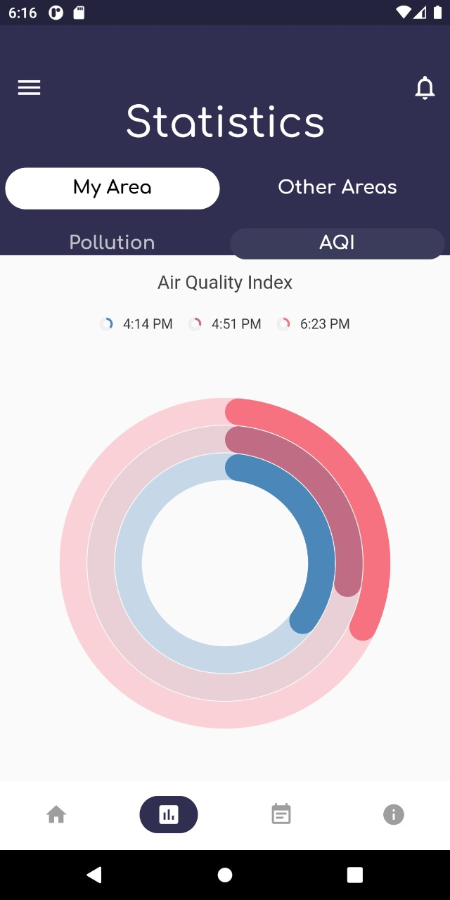
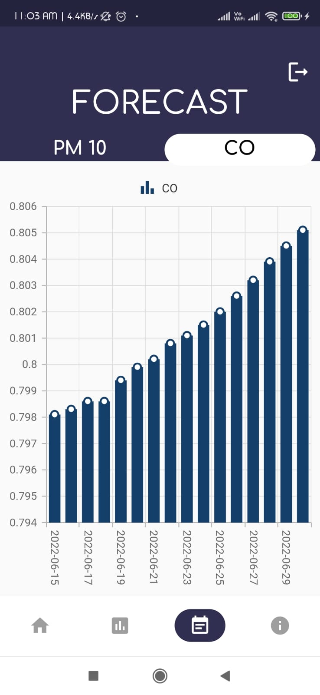
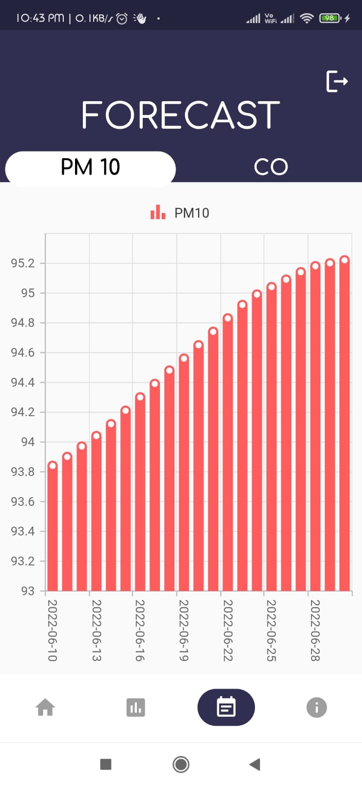

# AIRFACTOR
Our project named ‘AIRFACTOR’ is a flutter based application project built solely for the domains related to air pollution. This project focuses on several agendas related to air pollution in the region of Bangalore.
The first area that it focuses on is the monitoring of near real-time levels of the pollutants.This project lets any user view the near-real time levels of some of the most dominant  pollutants using a graph visualization. The user has the option to look at specific pollutants only or all the pollutants. 
The next area it focuses on,  is to also show the graduate changes in the Air Quality Index of Bangalore throughout the day.
Approximately the pollution levels are re-recorded by the pollution stations after every thirty minutes and simultaneously updated in the application in the form of a  data visualization.
The project also has the feature of viewing the Air Quality Indices collected at different stations throughout the region of bangalore for a day and showing them in an similar data visualization format. AirFactor also holds the agenda of informing its users about the air pollution, its cause, its effects and its prevention.
For this purpose, the main dashboard of the application has two areas, one that informs any user of the precautions that can be taken to reduce the air pollution level from their site. 
As well as there is a section focusing on informing the users regarding the effects of each of the dominant pollutants. 
Now coming to the main highlight of our project is the forecasting of two of the dominant pollutants out there : Particulate Matter 10( size < 10 micromillimeters), also known as PM10,  and  Carbon Monoxide, also known as CO. 
The reason we call this the highlight of our project is because most other air quality monitoring websites mostly focus on calculating the Air Quality Index prediction for the next few days. Now this Air Quality Index is nothing but the level of PM2.5 found in the atmosphere.
PM2.5 is undoubtedly the most dominant pollutant out of all the other dominant pollutants. However it should not go unacknowledged that the Air Quality is also affected by other dominant pollutants like PM10 and Carbon Monoxide.
The project also has an educational edge to it where it has images and small information cards within the application itself to inform the user and teach them about different ways to prevent air pollution and the effects of different air pollutants.

## Usage 
1. This is the logo that appears in the screen of an user

   
   
2. To use the application, the user must first signup (if they are new to the application) or  login if they're coming back to use the application again, they will we seeing this screen
  
   
   
3. After Logging-in  or Signing-up the user will be redirected to  the Dashboard

 

4. The Dashboard will have features like precaution tips and Prevention tips, there's also a bottom navigation bar using which the user can browse around

     

5. The user can then navigate to the statistics screen to look at the pollution level and the AQI levels 

     

6. The user can also move forward to the forecast screen where they can see the predicted levels of CO and PM10

     

7. Once satisfied the user can logout by clicking the icon on the top right of the page.

